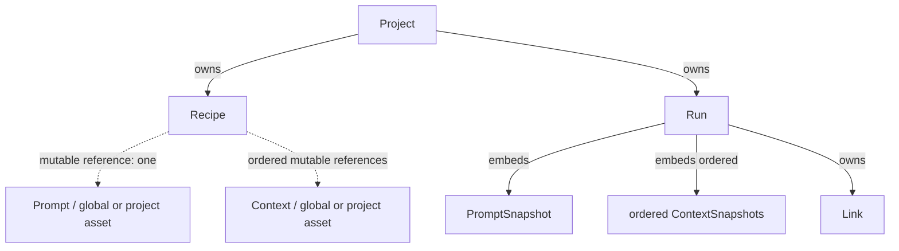

# Prompt Trail Data Model

Prompt Trail の Data Model 正本です。P0-5 完了時点の Domain、Dexie 永続化、Repository、Sample Seed の公開契約を、実装に基づいて一続きで記録します。Runtime、画面、Provider、Router の責務は [Application Architecture](../../product/prompt-trail/application-architecture.md) を参照してください。

## 正本の範囲

本書は次を扱います。

- Project、Prompt、Context、Recipe、Run、Link の 6 Domain Model と共通規約
- 所有、scope、可変参照、Snapshot
- `prompt-trail` の schema version 1、Store、主キー、索引、保存境界
- Repository の公開 API、参照整合性、error、transaction、lifecycle
- Fresh DB と明示的な Sample Seed のデータ契約

ID Factory、追加の schema migration、archive/restore 専用 API、画面・起動時の振る舞いはこの時点では実装しません。

## モデル関係と所有境界

Project は Recipe と Run の所有境界です。Prompt と Context は global または Project 専用の asset です。Recipe は Prompt 本文や Context 本文を複製せず、1 件の `promptId` と順序付き `contextIds` で可変参照します。Run は実行時点の Prompt/Context Snapshot、`inputValues`、`finalPrompt` を固定保存します。Link は Run に所属し、`projectId` を重複保存しません。Link の Project 所属は `Link → Run → Project` で解決します。

## 共通 Domain 規約

`PromptTrailEntityKind` は `project`、`prompt`、`context`、`recipe`、`run`、`link` の 6 種別です。`EntityId<Kind>` は TypeScript 上の nominal ID で、実行時と保存時の表現は文字列です。`UtcDateTimeString` は ISO 8601 UTC 文字列です。Domain の唯一の公開入口は `apps/prompt-trail/src/domain/index.ts` です。

| Contract           | Rule                                                                                                                                 |
| ------------------ | ------------------------------------------------------------------------------------------------------------------------------------ |
| `BaseEntity`       | `id`、`createdAt`、`updatedAt`、`deletedAt` を持ちます。                                                                             |
| `ArchivableEntity` | archive 可能な Project と Run にだけ `archivedAt` を合成します。                                                                     |
| Optional scalar    | 単一の任意値は `null` で表し、保存表現に `undefined` を使いません。                                                                  |
| Collections        | 複数値は空配列で表します。`contextIds` と `contextSnapshots` は順序を保持します。                                                    |
| Input values       | 未入力の `inputValues` は空オブジェクトです。                                                                                        |
| `AssetScope`       | global は `{ scope: "global" }`、project asset は `{ scope: "project", projectId }` です。global asset は `projectId` を持ちません。 |

保存契約では nominal type 付き文字列を各 Store の主キーに使用し、DB auto increment は使いません。汎用 ID Factory / ID 生成サービスは未実装です。

## 6 Domain Model

| Model   | 主な内容                                                                                        |
| ------- | ----------------------------------------------------------------------------------------------- |
| Project | `name`、任意の `description` / `repositoryUrl`、`tags`、`archivedAt` を持つ所有境界です。       |
| Prompt  | Markdown の `title` / `body`、`kind`、`status`、`tags` と AssetScope を持つ再利用 asset です。  |
| Context | 背景・制約・ルールの Markdown、`kind`、`status`、`tags` と AssetScope を持つ再利用 asset です。 |
| Recipe  | Project 配下の 1 Prompt と 0 件以上の順序付き Context への可変参照です。                        |
| Run     | Recipe からの実行証跡です。Snapshot、入力値、最終 Prompt、評価、`archivedAt` を保持します。     |
| Link    | Chat、Issue、PR、Commit 等への URL を type / role とともに Run 配下に保存します。               |

Prompt の `deprecated`、Context の `disabled`、Project / Run の `archivedAt`、全モデルの `deletedAt` は別の状態です。Snapshot は元 asset が更新、無効化、soft delete されても変更しません。

## Domain / Store / Repository 対応

| Model   | Dexie Store | 主な Repository API                                                        |
| ------- | ----------- | -------------------------------------------------------------------------- |
| Project | `projects`  | `saveProject` / `getProject` / `listActiveProjects` / `softDeleteProject`  |
| Prompt  | `prompts`   | `savePrompt` / `getPrompt` / `listActivePrompts` / `softDeletePrompt`      |
| Context | `contexts`  | `saveContext` / `getContext` / `listEnabledContexts` / `softDeleteContext` |
| Recipe  | `recipes`   | `saveRecipe` / `getRecipe` / `listActiveRecipes` / `softDeleteRecipe`      |
| Run     | `runs`      | `saveRun` / `getRun` / `listActiveRuns` / `softDeleteRun`                  |
| Link    | `links`     | `saveLink` / `getLink` / `listActiveLinks` / `softDeleteLink`              |

6 モデルを一括登録する `insertTrailBundle()` も公開します。

## Dexie 永続化: schema version 1

- Database name: `prompt-trail`
- Schema version: `1`
- 1 モデルにつき 1 Store
- 各 Store の主キーは model の `id`。auto increment は使用しません。

| Store      | Primary key | Index                                                                     | 保存境界                                                    |
| ---------- | ----------- | ------------------------------------------------------------------------- | ----------------------------------------------------------- |
| `projects` | `id`        | `updatedAt`, `archivedAt`, `deletedAt`                                    | Project 単体                                                |
| `prompts`  | `id`        | `scope`, `projectId`, `status`, `updatedAt`, `deletedAt`                  | 本文、tags、状態、scope を record に埋め込み                |
| `contexts` | `id`        | `scope`, `projectId`, `status`, `updatedAt`, `deletedAt`                  | 本文、tags、状態、scope を record に埋め込み                |
| `recipes`  | `id`        | `projectId`, `promptId`, `updatedAt`, `deletedAt`                         | 順序付き `contextIds` を record に埋め込み                  |
| `runs`     | `id`        | `projectId`, `recipeId`, `status`, `updatedAt`, `archivedAt`, `deletedAt` | Snapshot、`inputValues`、`finalPrompt` を record に埋め込み |
| `links`    | `id`        | `runId`, `createdAt`, `deletedAt`                                         | Run に属する Link を独立 record として保存                  |

schema v1 は外部キー制約を提供しません。複合索引、全文検索索引、tags、本文、URL、Snapshot 内部項目の索引も追加しません。参照整合性は Repository 境界で検証します。

## Repository 公開契約

### 保存と取得

`save*()` は部分更新 API ではなく、完全な Domain Entity を `put` する置換保存です。Prompt、Context、Recipe、Run、Link は保存前に必要な参照検証を行います。Repository constructor は DB の open / close / delete を行いません。

`get*()` は存在しないとき `null` を返します。ID 指定取得では soft delete / archive 済みの record も取得できます。これは active list の除外条件とは別の契約です。

### 通常一覧

| API                               | 条件                                               | 並び順           |
| --------------------------------- | -------------------------------------------------- | ---------------- |
| `listActiveProjects()`            | 非削除・非 archive                                 | `updatedAt` 降順 |
| `listActivePrompts(projectId?)`   | 非削除・`active`・global または指定 Project scope  | `updatedAt` 降順 |
| `listEnabledContexts(projectId?)` | 非削除・`enabled`・global または指定 Project scope | `updatedAt` 降順 |
| `listActiveRecipes(projectId)`    | 非削除・指定 Project                               | `updatedAt` 降順 |
| `listActiveRuns(projectId)`       | 非削除・非 archive・指定 Project                   | `updatedAt` 降順 |
| `listActiveLinks(runId)`          | 非削除・指定 Run                                   | `createdAt` 昇順 |

### Soft delete とライフサイクル

`softDelete*()` は物理削除ではなく `deletedAt` を設定し、通常一覧から除外します。ID 指定取得では record を保持します。自動 cascade delete は行いません。現行 soft delete API は `deletedAt` のみを更新し、`updatedAt` を自動更新しません。

モデル上で表現できる状態と、専用 Repository API は区別します。実装済み操作は完全 Entity の save、ID get、active list、soft delete、TrailBundle atomic insert です。`archiveProject()`、`archiveRun()`、`restore*()`、deleted / archived 一覧、物理削除、cascade delete の専用 API はありません。

## 参照整合性

| 保存対象                        | Repository の検証契約                                                                               |
| ------------------------------- | --------------------------------------------------------------------------------------------------- |
| Project scoped Prompt / Context | Project が存在し、soft delete されていません。                                                      |
| Global Prompt / Context         | `projectId` を持ちません。                                                                          |
| Recipe                          | Project / Prompt / Context が存在し利用可能です。                                                   |
| Recipe scope                    | Project scoped asset の Project は Recipe と一致します。                                            |
| Recipe contexts                 | `contextIds` に重複はなく、順序を保持します。                                                       |
| Run                             | Project / Recipe が存在し利用可能で、Project が一致します。                                         |
| Run Snapshot                    | Prompt Snapshot ID と Recipe Prompt が一致し、Context Snapshot の件数・順序が Recipe と一致します。 |
| Link                            | 所属 Run が存在し、soft delete されていません。                                                     |
| TrailBundle                     | 全 ID が未登録です。                                                                                |

## Repository error 契約

| Code                    | 意味・主な発生条件                                                                    |
| ----------------------- | ------------------------------------------------------------------------------------- |
| `storage-failure`       | 公開 error 語彙です。現行 Repository 処理では明示的に生成していません。               |
| `reference-not-found`   | 必要な Project、Prompt、Context、Recipe、Run、または soft delete 対象が存在しません。 |
| `reference-unavailable` | 参照先が soft delete、deprecated、disabled などで利用できません。                     |
| `scope-mismatch`        | global asset の `projectId`、または不正な project scope を検出しました。              |
| `duplicate-context-id`  | Recipe の `contextIds` が重複しています。                                             |
| `project-mismatch`      | Project scoped asset または Run/Recipe の Project が一致しません。                    |
| `snapshot-mismatch`     | Run Snapshot の Prompt または Context 件数・順序が Recipe と一致しません。            |
| `duplicate-id`          | TrailBundle に既登録 ID が含まれます。                                                |

## Transaction と rollback

| 操作                | Transaction 対象                        |
| ------------------- | --------------------------------------- |
| `savePrompt`        | projects + prompts                      |
| `saveContext`       | projects + contexts                     |
| `saveRecipe`        | projects + prompts + contexts + recipes |
| `saveRun`           | projects + recipes + runs               |
| `saveLink`          | runs + links                            |
| `insertTrailBundle` | 6 Store すべて                          |

`insertTrailBundle()` は 1 回の `rw` transaction 内で ID 重複検査、参照検証、Project、Prompt、Context、Recipe、Run、Links の登録を行います。途中で失敗すると transaction 全体が rollback されます。

## Fresh DB と Sample Seed

Fresh DB の 6 Store は空であり、通常起動で自動 seed しません。Sample Seed は独立した明示処理です。preflight で sample の ID、利用状態、所有・参照関係を確認し、未登録なら `insertTrailBundle()` による atomic insert を行います。

| Result            | 条件                                                                 |
| ----------------- | -------------------------------------------------------------------- |
| `seeded`          | sample ID が未登録で、TrailBundle を登録しました。                   |
| `already-present` | sample の全 record が存在し、利用可能な関係を満たします。            |
| `conflict`        | 一部のみ存在する、または expected な所有・参照・状態を満たしません。 |

Seed は既存 sample 内容を上書きしません。Prompt 本文などのユーザー編集内容は complete 判定の対象外です。起動や画面状態の詳細は Application Architecture を参照してください。

## Source Map

| 責務                | 実装                                                          |
| ------------------- | ------------------------------------------------------------- |
| Domain 共通型       | `apps/prompt-trail/src/domain/common.ts`                      |
| Domain 公開入口     | `apps/prompt-trail/src/domain/index.ts`                       |
| 6 モデル            | `apps/prompt-trail/src/domain/*.ts`                           |
| DB metadata         | `apps/prompt-trail/src/db/metadata.ts`                        |
| Dexie schema        | `apps/prompt-trail/src/db/database.ts`                        |
| Repository 公開入口 | `apps/prompt-trail/src/repository/index.ts`                   |
| Repository 実装     | `apps/prompt-trail/src/repository/prompt-trail-repository.ts` |
| Repository errors   | `apps/prompt-trail/src/repository/errors.ts`                  |
| Sample Seed         | `apps/prompt-trail/src/sample-data/seed-sample-data.ts`       |
| Contract tests      | Domain / DB / Repository / Sample Data の関連 `*.test.ts`     |

## 更新トリガー

次の変更では本書を更新します。

- Domain Model、ID、status、scope、Trail 関係を変更するとき
- schema version、Store、index、migration を変更するとき
- Repository 公開 API、通常取得条件、参照整合性、error code、transaction 境界を変更するとき
- archive / restore 等の専用 API を追加するとき
- Sample Seed の preflight または atomicity を変更するとき
