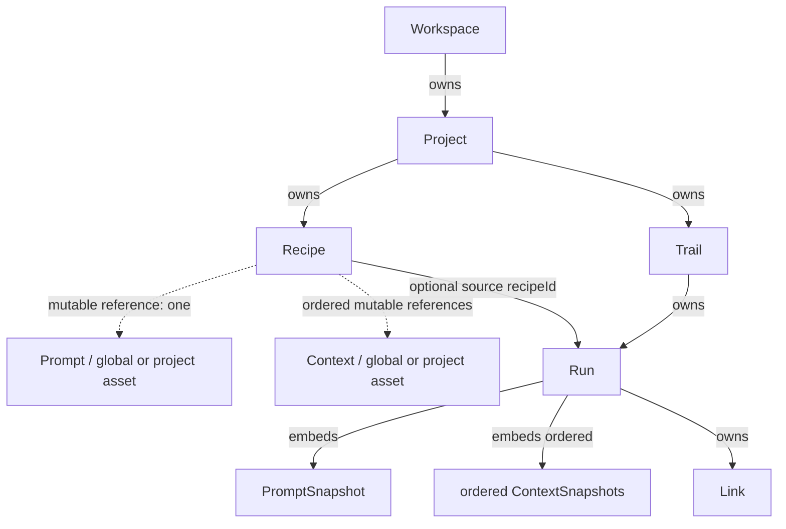

# Prompt Trail Data Model

Prompt Trail の Data Model 正本です。P3-1（Trail Domain 設計 + Schema migration）完了時点の Domain、Dexie 永続化、Repository、Sample Seed の公開契約を、実装に基づいて一続きで記録します。Runtime、画面、Provider、Router の責務は [Application Architecture](../../product/prompt-trail/application-architecture.md) を参照してください。Workspace / Trail の責務分割の背景は [ADR 0004](../../adr/0004-workspace-project-responsibility.md)、[ADR 0005](../../adr/0005-trail-run-responsibility.md) を参照してください。

## 正本の範囲

本書は次を扱います。

- Workspace、Project、Prompt、Context、Recipe、Trail、Run、Link の 8 Domain Model と共通規約
- 所有、scope、可変参照、Snapshot
- `prompt-trail` の schema version 5、Store、主キー、索引、migration、保存境界
- Repository の公開 API、参照整合性、error、transaction、lifecycle
- Fresh DB と明示的な Sample Seed のデータ契約

ID Factory、Workspace の CRUD・切替 UI、Trail 単位の複数 Run 表示、archive/restore 専用 API は未実装です。画面・起動時の振る舞いは未実装ではなく本書の対象外であり、その正本は [Application Architecture](../../product/prompt-trail/application-architecture.md) です。

## モデル関係と所有境界

```mermaid
flowchart TD
  Workspace[Workspace]
  Project[Project]
  Prompt[Prompt / global or project asset]
  Context[Context / global or project asset]
  Recipe[Recipe]
  Trail[Trail]
  Run[Run]
  PromptSnapshot[PromptSnapshot]
  ContextSnapshots[ordered ContextSnapshots]
  Link[Link]

  Workspace -->|owns| Project
  Project -->|owns| Recipe
  Project -->|owns| Trail
  Trail -->|owns| Run
  Recipe -->|optional source recipeId| Run
  Recipe -. mutable reference: one .-> Prompt
  Recipe -. ordered mutable references .-> Context
  Run -->|embeds| PromptSnapshot
  Run -->|embeds ordered| ContextSnapshots
  Run -->|owns| Link
```

Workspace は Project の所有境界です。現時点では Default Workspace のみが存在し、複数 Workspace の CRUD・切替は未実装です（背景は [ADR 0004](../../adr/0004-workspace-project-responsibility.md)）。Project は Recipe と Trail の所有境界です。Prompt と Context は global または Project 専用の asset です。Recipe は Prompt 本文や Context 本文を複製せず、1 件の `promptId` と順序付き `contextIds` で可変参照します。Trail は Project に直接属する独立した作業単位で、AssetScope は持ちません。Run は Trail に属し、実行時点の Prompt/Context Snapshot、`inputValues`、`finalPrompt` を固定保存します（背景は [ADR 0005](../../adr/0005-trail-run-responsibility.md)）。`Run.projectId` は Trail 経由で導出可能な冗長 field ですが、既存 Repository/Query 実装を変えないため当面維持します。Link は Run に所属し、`projectId` を重複保存しません。Link の Project 所属は `Link → Run → Trail → Project` で解決します。

## 共通 Domain 規約

`PromptTrailEntityKind` は `workspace`、`project`、`prompt`、`context`、`recipe`、`run`、`link`、`trail` の 8 種別です。`EntityId<Kind>` は TypeScript 上の nominal ID で、実行時と保存時の表現は文字列です。`UtcDateTimeString` は ISO 8601 UTC 文字列です。Domain の唯一の公開入口は `apps/prompt-trail/src/domain/index.ts` です。

| Contract           | Rule                                                                                                                                                                                |
| ------------------ | ----------------------------------------------------------------------------------------------------------------------------------------------------------------------------------- |
| `BaseEntity`       | `id`、`createdAt`、`updatedAt`、`deletedAt` を持ちます。                                                                                                                            |
| `ArchivableEntity` | archive 可能な Project、Trail、Run にだけ `archivedAt` を合成します。                                                                                                               |
| Optional scalar    | 単一の任意値は `null` で表し、保存表現に `undefined` を使いません。                                                                                                                 |
| Collections        | 複数値は空配列で表します。`contextIds` と `contextSnapshots` は順序を保持します。                                                                                                   |
| Input values       | 未入力の `inputValues` は空オブジェクトです。                                                                                                                                       |
| `AssetScope`       | global は `{ scope: "global" }`、project asset は `{ scope: "project", projectId }` です。global asset は `projectId` を持ちません。Workspace と Trail は AssetScope を持ちません。 |

保存契約では nominal type 付き文字列を各 Store の主キーに使用し、DB auto increment は使いません。汎用 ID Factory / ID 生成サービスは未実装です。

## 8 Domain Model

すべての model は `BaseEntity<Kind>`、すなわち `id: <Model>Id`、`createdAt: UtcDateTimeString`、`updatedAt: UtcDateTimeString`、`deletedAt: UtcDateTimeString | null` を持ちます。Project、Trail、Run はさらに `archivedAt: UtcDateTimeString | null` を持ちます。

| Model     | 公開フィールドと型                                                                                                                                                                                                                                                                                                                                        |
| --------- | --------------------------------------------------------------------------------------------------------------------------------------------------------------------------------------------------------------------------------------------------------------------------------------------------------------------------------------------------------- |
| Workspace | `name: string`                                                                                                                                                                                                                                                                                                                                            |
| Project   | `workspaceId: WorkspaceId`、`name: string`、`description: string \| null`、`tags: readonly string[]`、`repositoryUrl: string \| null`                                                                                                                                                                                                                     |
| Prompt    | `scope: "global"` または `scope: "project"; projectId: ProjectId`、`title: string`、`body: string`、`status: PromptStatus`、`tags: readonly string[]`、`variableValues: Record<string, string>`                                                                                                                                                           |
| Context   | `scope: "global"` または `scope: "project"; projectId: ProjectId`、`title: string`、`body: string`、`kind: ContextKind`、`status: ContextStatus`、`tags: readonly string[]`                                                                                                                                                                               |
| Recipe    | `projectId: ProjectId`、`title: string`、`description: string \| null`、`promptId: PromptId`、`contextIds: readonly ContextId[]`（順序付き）                                                                                                                                                                                                              |
| Trail     | `projectId: ProjectId`、`title: string`、`kind: TrailKind`                                                                                                                                                                                                                                                                                                |
| Run       | `projectId: ProjectId`、`trailId: TrailId`、`recipeId: RecipeId \| null`、`promptSnapshot: PromptSnapshot`、`contextSnapshots: readonly ContextSnapshot[]`（順序付き）、`inputValues: { readonly [variableName: string]: JsonValue }`、`finalPrompt: string`、`status: RunStatus`、`evaluation: RunEvaluation \| null`、`improvementNote: string \| null` |
| Link      | `runId: RunId`、`url: string`、`title: string \| null`、`type: LinkType`、`role: LinkRole`、`summary: string \| null`、`externalId: string \| null`                                                                                                                                                                                                       |

| Contract          | Shape / allowed values                                                                                      |
| ----------------- | ----------------------------------------------------------------------------------------------------------- |
| `PromptStatus`    | `draft` / `active` / `deprecated`                                                                           |
| `ContextKind`     | `project-overview` / `technical-architecture` / `development-rules` / `glossary` / `output-rules` / `other` |
| `ContextStatus`   | `enabled` / `disabled`                                                                                      |
| `RunStatus`       | `draft` / `prepared` / `executed` / `in-progress` / `done`                                                  |
| `RunEvaluation`   | `good` / `needs-improvement` / `failed`                                                                     |
| `TrailKind`       | `planning-design` / `development` / `research` / `review` / `incident-response` / `other`                   |
| `LinkType`        | `chat` / `issue` / `pull-request` / `commit` / `release` / `document` / `external`                          |
| `LinkRole`        | `source` / `reference` / `execution` / `output` / `result`                                                  |
| `PromptSnapshot`  | `{ promptId: PromptId; title: string; body: string }`                                                       |
| `ContextSnapshot` | `{ contextId: ContextId; title: string; body: string }`                                                     |
| `JsonValue`       | `string \| number \| boolean \| null \| readonly JsonValue[] \| { readonly [key: string]: JsonValue }`      |

Prompt の `deprecated`、Context の `disabled`、Project / Run の `archivedAt`、全モデルの `deletedAt` は別の状態です。Snapshot は元 asset が更新、無効化、soft delete されても変更しません。Prompt起点のTrail作成では、`body`をraw templateのまま`PromptSnapshot.body`へ固定するわけではなく、`resolvePromptVariables`で元Promptの`variableValues`を反映して`${varName}`を解決した後、利用者が本文欄で自由に確認・編集した内容をSnapshotします（未入力の変数は`${varName}`のまま残ります）。

## Domain / Store / Repository 対応

| Model     | Dexie Store  | 主な Repository API                                                                       |
| --------- | ------------ | ----------------------------------------------------------------------------------------- |
| Workspace | `workspaces` | `saveWorkspace` / `getWorkspace` / `listActiveWorkspaces` / `softDeleteWorkspace`         |
| Project   | `projects`   | `saveProject` / `getProject` / `listActiveProjects` / `softDeleteProject`                 |
| Prompt    | `prompts`    | `savePrompt` / `getPrompt` / `listActivePrompts` / `softDeletePrompt`                     |
| Context   | `contexts`   | `saveContext` / `getContext` / `listEnabledContexts` / `softDeleteContext`                |
| Recipe    | `recipes`    | `saveRecipe` / `getRecipe` / `listActiveRecipes` / `softDeleteRecipe`                     |
| Trail     | `trails`     | `saveTrail` / `getTrail` / `listActiveTrails` / `softDeleteTrail` / `updateTrailMetadata` |
| Run       | `runs`       | `saveRun` / `getRun` / `listActiveRuns` / `softDeleteRun`                                 |
| Link      | `links`      | `saveLink` / `getLink` / `listActiveLinks` / `softDeleteLink`                             |

Project・Prompt・Context・Recipe・Trail・Run・Link の 7 モデルを一括登録する `insertTrailBundle()` に加え、Public Alpha の Direct Run 用に `createDirectRunBundle()` を公開します。`DEFAULT_PROJECT_ID` は `prompt-trail-default-project`、`DEFAULT_WORKSPACE_ID` は `prompt-trail-default-workspace` で、いずれも Sample Dataset の ID とは別です。

## Dexie 永続化: schema version 5

- Database name: `prompt-trail`
- Schema version: `5`
- 1 モデルにつき 1 Store
- 各 Store の主キーは model の `id`。auto increment は使用しません。

| Store        | Primary key | Index                                                                     | 保存境界                                                    |
| ------------ | ----------- | ------------------------------------------------------------------------- | ----------------------------------------------------------- |
| `projects`   | `id`        | `updatedAt`, `archivedAt`, `deletedAt`                                    | Project 単体                                                |
| `prompts`    | `id`        | `scope`, `projectId`, `status`, `updatedAt`, `deletedAt`                  | 本文、tags、状態、scope を record に埋め込み                |
| `contexts`   | `id`        | `scope`, `projectId`, `status`, `updatedAt`, `deletedAt`                  | 本文、tags、状態、scope を record に埋め込み                |
| `recipes`    | `id`        | `projectId`, `promptId`, `updatedAt`, `deletedAt`                         | 順序付き `contextIds` を record に埋め込み                  |
| `runs`       | `id`        | `projectId`, `recipeId`, `status`, `updatedAt`, `archivedAt`, `deletedAt` | Snapshot、`inputValues`、`finalPrompt` を record に埋め込み |
| `links`      | `id`        | `runId`, `createdAt`, `deletedAt`                                         | Run に属する Link を独立 record として保存                  |
| `workspaces` | `id`        | `updatedAt`, `deletedAt`                                                  | Workspace 単体                                              |
| `trails`     | `id`        | `projectId`, `updatedAt`, `deletedAt`                                     | Trail 単体（`title`、`kind` を record に埋め込み）          |

schema v2 はschema v1と同じ6 Store・主キー・索引を維持し、`trailTitle`と`trailKind`を索引へ追加しません。schema v1定義はupgrade起点として保持します。v1からv2へのupgrade transactionは全Runへ`trailTitle = promptSnapshot.title`（正規化なし）と`trailKind = other`を追加し、他fieldや他Storeを変更しません。不正なPrompt Snapshotを持つRunではupgradeを中断し、transaction全体をrollbackします。

schema v3 はschema v2と同じ6 Store・主キー・索引を維持し、`variableValues`を索引へ追加しません。schema v2定義はupgrade起点として保持します。v2からv3へのupgrade transactionは全Promptへ`variableValues`が未定義の場合のみ`{}`を補完し、他fieldや他Storeを変更しません。

schema v4 はschema v3と同じ6 Store・主キー・索引を維持します。schema v3定義はupgrade起点として保持します。v3からv4へのupgrade transactionは、廃止したPromptの`kind` fieldを`tags`へ移行します。`kind`が設定されている場合、対応するラベル（`chat-consultation`→「チャット相談」、`codex-request`→「Codex依頼」、`issue-creation`→「Issue作成」、`design-review`→「設計レビュー」、`incident-analysis`→「障害分析」）を`tags`未登録の場合のみ追加し、`kind` fieldを削除します。他fieldや他Storeを変更しません。

schema v5 は既存 6 Store・主キー・索引を維持したまま `workspaces` と `trails` の 2 Store を追加します。schema v4 定義はupgrade起点として保持します。v4からv5へのupgrade transactionは `version(5).upgrade(tx => ...)` を用い、次を順に行います。(1) `workspaces` Store に Default Workspace を1件作成する、(2) 既存 `projects` の全レコードへ `workspaceId = DEFAULT_WORKSPACE_ID` を補完する、(3) 既存 Run 1件につき `trailTitle`/`trailKind`/`projectId` から Trail レコードを1件作成する（1 Run : 1 Trail backfill）、(4) 既存 `runs` の全レコードへ対応する Trail の `id` を `trailId` として補完し、`trailTitle`/`trailKind` を削除する。途中で`trailTitle`または`trailKind`を欠くRunを検出した場合はupgradeを中断し、transaction全体をrollbackします（DBの削除・部分更新は行いません）。

## Repository 公開契約

### 保存と取得

`save*()` は部分更新 API ではなく、完全な Domain Entity を `put` する置換保存です。Prompt、Context、Recipe、Run、Link は保存前に必要な参照検証を行います。Repository constructor は DB の open / close / delete を行いません。

`get*()` は存在しないとき `null` を返します。ID 指定取得では soft delete / archive 済みの record も取得できます。これは active list の除外条件とは別の契約です。

### 通常一覧

| API                               | 条件                                               | 並び順           |
| --------------------------------- | -------------------------------------------------- | ---------------- |
| `listActiveProjects()`            | 非削除・非 archive                                 | `updatedAt` 降順 |
| `listActivePrompts(projectId?)`   | 非削除・`active`・global または指定 Project scope  | `updatedAt` 降順 |
| `listEnabledContexts(projectId?)` | 非削除・`enabled`・global または指定 Project scope | `updatedAt` 降順 |
| `listActiveRecipes(projectId)`    | 非削除・指定 Project                               | `updatedAt` 降順 |
| `listActiveTrails(projectId)`     | 非削除・非 archive・指定 Project                   | `updatedAt` 降順 |
| `listActiveRuns(projectId)`       | 非削除・非 archive・指定 Project                   | `updatedAt` 降順 |
| `listActiveLinks(runId)`          | 非削除・指定 Run                                   | `createdAt` 昇順 |

### Soft delete とライフサイクル

`softDelete*()` は物理削除ではなく `deletedAt` を設定し、通常一覧から除外します。ID 指定取得では record を保持します。自動 cascade delete は行いません。現行 soft delete API は `deletedAt` のみを更新し、`updatedAt` を自動更新しません。

モデル上で表現できる状態と、専用 Repository API は区別します。実装済み操作は完全 Entity の save、ID get、active list、soft delete、TrailBundle atomic insert です。`archiveProject()`、`archiveRun()`、`restore*()`、deleted / archived 一覧、物理削除、cascade delete の専用 API はありません。

## 参照整合性

| 保存対象                         | Repository の検証契約                                                                                                                              |
| -------------------------------- | -------------------------------------------------------------------------------------------------------------------------------------------------- |
| Project scoped Prompt / Context  | Project が存在し、soft delete されていません。                                                                                                     |
| Global Prompt / Context          | `projectId` を持ちません。                                                                                                                         |
| Recipe                           | Project / Prompt / Context が存在し利用可能です。                                                                                                  |
| Recipe scope                     | Project scoped asset の Project は Recipe と一致します。                                                                                           |
| Recipe contexts                  | `contextIds` に重複はなく、順序を保持します。                                                                                                      |
| Recipe Run (`recipeId !== null`) | Project / Recipe が存在し利用可能で、Project が一致します。                                                                                        |
| Recipe Run Snapshot              | Prompt Snapshot ID と Recipe Prompt が一致し、Context Snapshot の件数・順序が Recipe と一致します。                                                |
| Direct Run (`recipeId === null`) | active かつ非削除の project-scoped Prompt を参照し、Prompt / Run の Project が一致します。                                                         |
| Direct Run invariants            | Snapshot の ID、title、body は Prompt と完全一致し、`contextSnapshots` は `[]`、`inputValues` は `{}`、`finalPrompt` は Prompt body と一致します。 |
| Trail                            | 所属 Project が存在し、soft delete されていません。                                                                                                |
| Run と Trail                     | `Run.trailId` が参照する Trail が存在し、soft delete されておらず、`Trail.projectId` と `Run.projectId` が一致します。                             |
| Link                             | 所属 Run が存在し、soft delete されていません。                                                                                                    |
| TrailBundle                      | 全 ID が未登録です。                                                                                                                               |

## Repository error 契約

| Code                    | 意味・主な発生条件                                                                    |
| ----------------------- | ------------------------------------------------------------------------------------- |
| `storage-failure`       | 公開 error 語彙です。現行 Repository 処理では明示的に生成していません。               |
| `reference-not-found`   | 必要な Project、Prompt、Context、Recipe、Run、または soft delete 対象が存在しません。 |
| `reference-unavailable` | 参照先が soft delete、deprecated、disabled などで利用できません。                     |
| `scope-mismatch`        | global asset の `projectId`、または不正な project scope を検出しました。              |
| `duplicate-context-id`  | Recipe の `contextIds` が重複しています。                                             |
| `project-mismatch`      | Project scoped asset または Run/Recipe の Project が一致しません。                    |
| `snapshot-mismatch`     | Run Snapshot の Prompt または Context 件数・順序が Recipe と一致しません。            |
| `duplicate-id`          | TrailBundle に既登録 ID が含まれます。                                                |

## Transaction と rollback

| 操作                    | Transaction 対象                                |
| ----------------------- | ----------------------------------------------- |
| `savePrompt`            | projects + prompts                              |
| `saveContext`           | projects + contexts                             |
| `saveRecipe`            | projects + prompts + contexts + recipes         |
| `saveTrail`             | projects + trails                               |
| `saveRun`               | projects + prompts + recipes + trails + runs    |
| `saveLink`              | runs + links                                    |
| `insertTrailBundle`     | 8 Store すべて                                  |
| `createDirectRunBundle` | workspaces + projects + prompts + trails + runs |

`insertTrailBundle()` は 1 回の `rw` transaction 内で ID 重複検査、参照検証、Workspace 利用可否確認、Project、Prompt、Context、Recipe、Trail、Run、Links の登録を行います。途中で失敗すると transaction 全体が rollback されます。

`createDirectRunBundle()` は Direct Run 専用の公開契約です。既定 Workspace / Project が未登録なら作成し、既存なら上書きしません。既存 Project が削除または archive 済みなら `reference-unavailable` とし、復活させません。Prompt / Trail / Run の ID 重複と Direct Run の参照・Snapshot 不変条件を同じ transaction で検証するため、失敗時に Project や Prompt だけが残りません。既存の `insertTrailBundle()` は Recipe Run と Sample Dataset 用として維持します。

`recipeId: null` は schema version 5 の既存 `runs` Store に保存します。Direct Run の一覧・取得は `recipeId` index に依存しません。

## Fresh DB と Sample Seed

Fresh DB の 8 Store は空であり、通常起動で自動 seed しません（`workspaces` も含め、既定 Workspace は初回書き込み時に必要に応じて作成されます）。Sample Seed は独立した明示処理です。preflight で sample の ID、利用状態、所有・参照関係を確認し、未登録なら `insertTrailBundle()` による atomic insert を行います。

| Result            | 条件                                                                 |
| ----------------- | -------------------------------------------------------------------- |
| `seeded`          | sample ID が未登録で、TrailBundle を登録しました。                   |
| `already-present` | sample の全 record が存在し、利用可能な関係を満たします。            |
| `conflict`        | 一部のみ存在する、または expected な所有・参照・状態を満たしません。 |

Seed は既存 sample 内容を上書きしません。Prompt 本文などのユーザー編集内容は complete 判定の対象外です。起動や画面状態の詳細は Application Architecture を参照してください。

## Source Map

| 責務                | 実装                                                          |
| ------------------- | ------------------------------------------------------------- |
| Domain 共通型       | `apps/prompt-trail/src/domain/common.ts`                      |
| Domain 公開入口     | `apps/prompt-trail/src/domain/index.ts`                       |
| 8 モデル            | `apps/prompt-trail/src/domain/*.ts`                           |
| DB metadata         | `apps/prompt-trail/src/db/metadata.ts`                        |
| Dexie schema        | `apps/prompt-trail/src/db/database.ts`                        |
| Repository 公開入口 | `apps/prompt-trail/src/repository/index.ts`                   |
| Repository 実装     | `apps/prompt-trail/src/repository/prompt-trail-repository.ts` |
| Repository errors   | `apps/prompt-trail/src/repository/errors.ts`                  |
| Sample Seed         | `apps/prompt-trail/src/sample-data/seed-sample-data.ts`       |
| Contract tests      | Domain / DB / Repository / Sample Data の関連 `*.test.ts`     |

## 更新トリガー

次の変更では本書を更新します。

- Domain Model、ID、status、scope、Trail 関係を変更するとき
- schema version、Store、index、migration を変更するとき
- Repository 公開 API、通常取得条件、参照整合性、error code、transaction 境界を変更するとき
- archive / restore 等の専用 API を追加するとき
- Sample Seed の preflight または atomicity を変更するとき
