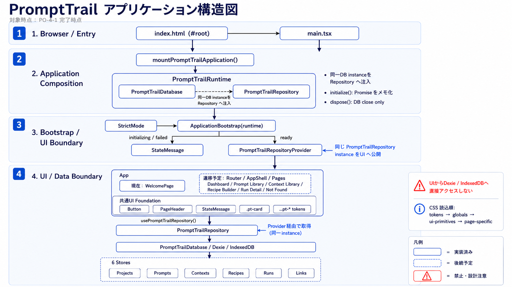

# PromptTrail Application Architecture

このドキュメントは **P0-4-3 完了時点** の PromptTrail アプリケーション構造を補足するものです。図は P0-4-1 時点の基盤構造を示し、この Markdown では P0-4-2 で追加された BrowserRouter、AppShell、AppRouter と、P0-4-3 で整備した主要 Page の静的画面骨格・状態表示方針を含む現行構成を整理します。



## 図の目的と読み方

この図は、PromptTrail の起動導線、Runtime から Repository／DB への依存注入、UI が利用できる境界を確認するための構造図です。図自体はP0-4-1時点の基盤構造を示しますが、本MarkdownではP0-4-3で確定したAppShell、Router、主要画面骨格、状態表示責務も補足し、現在どこまでが有効なアプリケーション境界かを把握できるようにしています。

### 凡例

- **実線**: P0-4-1 完了時点で実装済みの依存・呼び出し。
- **破線**: 後続 P0-4 で実装予定の依存・構成。
- **赤注記**: 禁止事項または設計上の注意点。

## 現行の主導線

P0-4-3 完了時点の起動から UI 表示までの主導線は次の通りです。

```text
index.html
  → main.tsx
  → mountPromptTrailApplication()
  → ApplicationBootstrap
  → PromptTrailRepositoryProvider
  → App
  → BrowserRouter
  → AppShell
  → AppRouter
  → Pages
```

`main.tsx` は `#root` を取得し、`mountPromptTrailApplication()` を呼び出します。`mountPromptTrailApplication()` は Runtime を生成または受け取り、React root の中で `ApplicationBootstrap` と `App` を組み立てます。`ApplicationBootstrap` は Runtime の初期化状態を管理し、初期化完了後に `PromptTrailRepositoryProvider` へ同一 Repository instance を渡します。`App` は `BrowserRouter` 配下に `AppShell` と `AppRouter` を配置し、共通レイアウトと route ごとの主要 Page を接続します。

## Runtime と Repository 公開境界

Runtime はアプリケーション起動時に単一の PromptTrail DB instance を生成または受け取り、その同一 DB を `PromptTrailRepository` へ注入します。UI へは DB そのものではなく、Runtime が保持する同じ Repository instance だけを `PromptTrailRepositoryProvider` 経由で公開します。

この境界により、UI は Repository の公開 API だけを利用します。UI コンポーネント、Page、Router、AppShell は Dexie や IndexedDB へ直接アクセスしてはいけません。DB schema や IndexedDB 固有の詳細は Repository／DB 層の責務として閉じ込めます。

## 各領域の責務

- **Runtime**: DB instance の作成または受け取り、Repository への DB 注入、DB open／close を含むライフサイクル管理を担う。
- **Bootstrap**: Runtime 初期化の実行、起動中／失敗／準備完了の表示切り替え、準備完了後の Provider 配置を担う。
- **Provider**: Runtime が公開する同一 Repository instance を React Context として UI に渡す境界を担う。
- **Repository／DB**: Dexie／IndexedDB を使った永続化、DB schema、Repository 公開契約、ドメインデータ操作を担う。
- **Router / AppShell / Pages**: BrowserRouter配下で既存routeを解決し、AppShell、Global Navigation、主要Pageの静的画面骨格、Dashboard復帰導線を担う。
- **共通 UI Foundation**: Button、PageHeader、PageSection、StateMessage、デザイントークンなど、Page 実装から再利用する UI 基盤を担う。

## 状態表示の責務境界

P0-4-3 時点では、状態表示を次の責務に分けます。`ApplicationBootstrap` は Runtime / Repository の初期化中と初期化失敗だけを扱い、初期化が完了するまで Page を描画しません。各 Page は Repository から実データを取得する前の **Page Start State** として、画面の目的、後続 Issue で置き換える領域、次の行動案内を `StateMessage variant="empty"` で示します。Router / Route は未知 URL と `/runs/:runId` の直接 URL を扱い、Dashboard への明示的な復帰導線を維持します。

将来の Repository empty state / failure state は P0-5 以降で Repository API 経由の取得結果として扱います。現在の Page Start State は、Repository 連携後に 0 件だった状態や利用時失敗を本物のデータ状態として表示するものではありません。UI 層から Dexie Table、Dexie Query、native IndexedDB API を直接参照しない原則も維持します。

## Router / AppShell / Pages

P0-4-3 完了時点では、Router、AppShell、主要 Pages が UI 層の最小構成として実装されています。`AppShell` は header、global navigation、main 領域を持つ共通レイアウトです。`AppRouter` は `/` を `/dashboard` へ redirectし、`/dashboard`、`/prompts`、`/contexts`、`/recipes/builder`、`/runs/:runId`、未知 URL の各 route を主要 Page に接続します。

Dashboard、Prompt Library、Context Library、Recipe Builder、Run Detail は `PageHeader`、`StateMessage`、`PageSection` を中心にした静的画面骨格を持ちます。これらの Page はP0-4-3時点ではRepositoryから実データを取得せず、P0-5以降でRepository連携後のempty / failure stateや実データ表示へ差し替えるための利用開始状態を示します。

Global Navigation は Dashboard、Prompt Library、Context Library、Recipe Builder の 4 項目に限定します。Run Detail と Not Found は常設ナビゲーションに含めず、どちらも Dashboard への明示的な復帰リンクを持ちます。Router／AppShell／Pages は Repository 公開 API を利用する UI 層として扱い、Dexie／IndexedDB へ直接アクセスしない原則を維持します。

## P0-4-4への引き渡し観点

P0-4-4では、P0-4-3で揃えた画面骨格と状態表示方針を壊さないため、次の回帰観点を重点的に扱います。

- Root URLからDashboardへのredirect。
- Dashboard、Prompt Library、Context Library、Recipe Builderへの直接URL表示とGlobal Navigationのactive判定。
- Run DetailとNot Foundがactive navなしで表示され、Dashboard復帰導線を維持すること。
- ApplicationBootstrapのloading / error / ready表示。
- 主要PageのPage Start Stateが、Repository連携後のempty / failure stateに見えないこと。
- UI層からDexie Table、Dexie Query、native IndexedDB APIを直接参照しないこと。

## 更新トリガー

この図と補足ドキュメントは、次の変更が入ったときに更新を検討します。

- Router／AppShell／主要 Pages の実装または責務が変わるとき。
- Runtime／Bootstrap／Provider の責務または依存関係の変更。
- DB schema／Repository 公開契約の変更。
- 共通 UI Foundation の責務、構成、依存関係の変更。
- P0-5以降でRepository連携、実データ表示、empty / failure stateの本格実装が入るとき。
