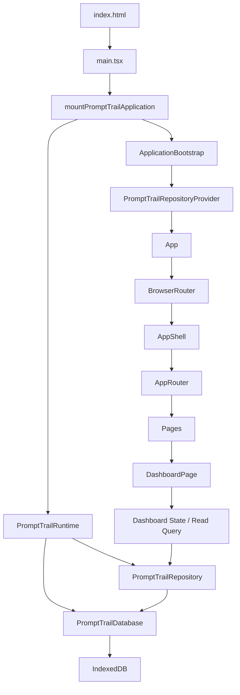
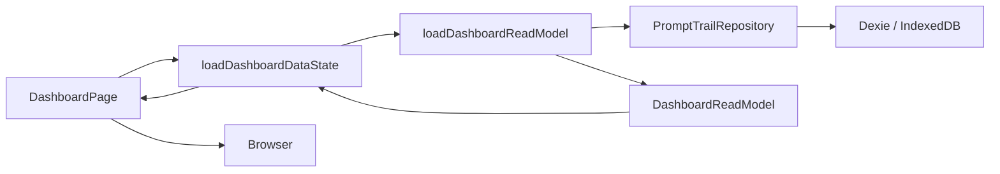

# PromptTrail Application Architecture

このドキュメントは、**P1-1-1-2 完了時点**の PromptTrail Application Architecture の正本です。起動、依存注入、Repository 公開境界、Dashboard の実データ読み取り、画面と状態の責務を、現行実装に合わせて説明します。

画面構成と利用者導線は [Screen Structure and User Flow](screen-transition.md)、6つのドメインモデルと永続化契約は [Data Model](../../architecture/prompt-trail/data-model.md) を正本とします。環境構築、障害診断、品質確認、Hosted Preview / Deploy の手順は、それぞれ [Local Development](../../development/local-development.md)、[Troubleshooting](../../development/troubleshooting.md)、[Quality Gates](../../development/quality-gates.md)、[Deployment and Hosted Preview](deployment-and-preview.md) を参照してください。本書ではそれらの手順を複製しません。

## 1. アーキテクチャ原則

PromptTrail は、UI と永続化実装を Repository 境界で分離します。

```text
UI / Page / Component
  → Repository 公開 API
  → Repository
  → Dexie / IndexedDB
```

- Page と Component は、Provider / Context から取得した Repository の公開 API のみを利用します。Dexie Table、Dexie Query、native IndexedDB API には直接アクセスしません。
- Runtime は DB instance と Repository instance を生成し、open / close を含むライフサイクルを管理します。UI へ DB を公開しません。
- Repository は Provider / Context 経由で UI へ公開します。ready 後の UI は同一の Repository instance を利用します。
- Page 固有の Read Model は Query 層で構築します。DB 層に画面判断を持ち込まず、JSX に取得・結合ロジックを混在させません。

## 2. 起動と依存注入

ブラウザ起動から Page 表示までの実装済み導線は次の通りです。



1. `index.html` の `#root` を `main.tsx` が取得し、`mountPromptTrailApplication()` を呼び出します。
2. Mount は、注入された Runtime を使用するか、`createPromptTrailRuntime()` で Runtime を作成して React root を作ります。
3. Runtime は `PromptTrailDatabase` と、その DB を注入した `PromptTrailRepository` を保持します。`initialize()` は DB を open し、`dispose()` は DB を close します。
4. `ApplicationBootstrap` は Runtime 初期化が終わるまで Page を表示しません。ready になった時だけ、Runtime が保持する Repository instance を Provider に渡します。
5. `App` は `BrowserRouter` の配下で `AppShell` と `AppRouter` を構成し、Route に対応する Page を表示します。

Mount が返す handle の `dispose()` は、React root を unmount した後に Runtime を dispose します。このため、UI と DB の終了処理を同じ application lifecycle から追跡できます。

## 3. レイヤー別の責務境界

| 領域                   | 主な責務                                                                 | 非責務                          |
| ---------------------- | ------------------------------------------------------------------------ | ------------------------------- |
| Entry                  | DOM root の取得、application mount の呼び出し                            | DB 初期化、データ取得           |
| Mount                  | Runtime / React root の生成、`dispose()` による unmount と Runtime close | Page のデータ状態管理           |
| Runtime                | DB / Repository の生成、DB open / close                                  | UI 表示、Route 判断             |
| Bootstrap              | 起動状態の管理、ready gate、Repository Provider の配置                   | Dashboard のデータ状態          |
| Provider               | 同一 Repository instance の Context 公開                                 | DB / Dexie の公開、DB lifecycle |
| Router / AppShell      | URL、Navigation、共通レイアウト、recovery route                          | 永続化、Read Model 構築         |
| Page                   | Use case の呼び出し、画面固有の表示状態                                  | Dexie / IndexedDB の直接操作    |
| Trail Creation Service | Prompt から Default Project / Direct Run bundle を構築・atomic 保存      | JSX、Dexie 直接操作             |
| Run Detail Query       | Run / Project / optional Recipe / active Link の取得・結合               | JSX、DB schema                  |
| Dashboard Query        | Dashboard Read Model の取得・結合                                        | JSX 表示、DB schema             |
| Repository             | 永続化契約、ドメイン操作                                                 | 画面状態、UI 表示               |
| DB                     | Dexie schema、IndexedDB 接続                                             | UI 判断、Page 固有の Read Model |

## 4. Dashboard の実データフロー

Dashboard は、Repository 接続済みの実データ画面です。`DashboardPage` は Provider から Repository を取得し、画面表示時に `loadDashboardDataState()` を呼び出します。



`loadDashboardReadModel()` は、次の順に Read Model を構築します。

1. Active Project を取得します。
2. Project ごとに Active Run を取得します。
3. それらを `updatedAt` 降順（同時刻の場合は Run ID）に並べ、Recent Run を抽出します。
4. 各 Run について Recipe と Active Link を取得します。
5. Project / Run / Recipe / Link を `DashboardReadModel` にまとめます。
6. Recipe が見つからないなど、Read Model の整合性を満たせない場合は例外とし、Data State が `failure` へ変換します。

取得中・空・失敗・データありの表示判断は `DashboardPage` と Dashboard State 層の責務です。Repository と DB は画面用の状態を保持しません。

## 5. 状態責務

起動状態と Dashboard のデータ状態は別の責務です。

| 状態               | 所有者                 | 意味                                     |
| ------------------ | ---------------------- | ---------------------------------------- |
| `initializing`     | `ApplicationBootstrap` | Runtime / DB 初期化中。Page は表示しない |
| `failed`           | `ApplicationBootstrap` | 起動失敗。Page は表示しない              |
| `ready`            | `ApplicationBootstrap` | Repository を Provider で公開できる      |
| `loading`          | `DashboardPage`        | Dashboard データ取得中                   |
| `empty`            | `DashboardPage`        | 正常取得済みで、表示対象 Run が 0 件     |
| `failure`          | `DashboardPage`        | Repository または Read Model の取得失敗  |
| `data`             | `DashboardPage`        | Dashboard Read Model を表示可能          |
| route recovery     | Router / Not Found     | 未知 URL から Dashboard へ復帰する状態   |
| static start state | 未接続 Page            | Phase 0 の画面入口を示す静的な骨格       |

Bootstrap の `failed` は DB / Repository 初期化に失敗して Page 自体を出せない状態です。一方、Dashboard の `failure` は Bootstrap が ready となり Repository が公開された後、Dashboard 固有の読み取りが失敗した状態です。Bootstrap ready 後に、Page 固有の `loading` が始まります。

## 6. Sample Dataset と通常起動

Fresh DB の通常起動は Seed を必須処理にせず、次の経路です。

```text
DB open
  → Repository 公開
  → Dashboard read
  → 0 件なら正常な Empty State
```

Sample Dataset は通常起動とは独立した、明示的な準備経路です。

```text
Canonical Sample Dataset
  → Explicit Seed Service
  → Repository
  → Dexie / IndexedDB
```

`seedSampleData()` は Repository を受け取り、Sample Dataset の事前状態を検査し、既存内容を上書きしません。全 Sample ID が未登録なら `seeded` を返します。必要な Sample ID がすべて存在し、利用状態と所有・参照関係が整合していれば `already-present` を返します。ID の欠落、所有関係・参照関係・利用状態の不整合があれば `conflict` を返します。Prompt のタイトルや本文など、ユーザーが編集できる内容は完全一致判定の対象外です。通常起動は Fresh DB を自動 Seed しません。

## 7. Route、AppShell、Page の現行状態

`AppShell` は header、Global Navigation、main 領域を提供します。`AppRouter` は `/` を `/dashboard` へ redirect し、各 route を Page へ接続します。Global Navigation は Dashboard、Prompt Library、Context Library、Recipe Builder の常設 route のみを表示します。Run Detail は contextual route、Not Found は recovery route であり、いずれも常設 Navigation の active 項目にはなりません。Not Found は Dashboard への復帰導線を提供します。

| 画面 / Route                        | 現行状態                             | 責務                                                        |
| ----------------------------------- | ------------------------------------ | ----------------------------------------------------------- |
| Dashboard (`/dashboard`)            | Repository 接続済み                  | loading / empty / failure / data を実データとして表示する   |
| Prompt Library (`/prompts`)         | 静的 start state                     | Prompt 管理の画面入口を示す。Repository 読み取りは未接続    |
| Context Library (`/contexts`)       | 静的 start state                     | Context 管理の画面入口を示す。Repository 読み取りは未接続   |
| Recipe Builder (`/recipes/builder`) | 静的 start state                     | Recipe 構築の画面入口を示す。Repository 読み取りは未接続    |
| New Trail (`/runs/new`)             | contextual route                     | Prompt から Direct Run を作成する                           |
| Run Detail (`/runs/:runId`)         | Repository 接続済み contextual route | loading / not-found / failure / data と Link 登録を表示する |
| Not Found (`*`)                     | recovery route                       | 未知 URL を示し、Dashboard へ復帰させる                     |

Prompt / Context / Recipe など、Dashboard 以外で未接続の Page は、Phase 0 の画面骨格です。これらの `StateMessage` は Repository 取得後の empty / failure を表すものではありません。

## 8. Source Map

| 責務                     | 実装                                                                                            |
| ------------------------ | ----------------------------------------------------------------------------------------------- |
| Browser Entry            | `apps/prompt-trail/src/main.tsx`                                                                |
| Application Mount        | `apps/prompt-trail/src/app/bootstrap.tsx`                                                       |
| Runtime Lifecycle        | `apps/prompt-trail/src/app/prompt-trail-runtime.ts`                                             |
| Startup State            | `apps/prompt-trail/src/app/ApplicationBootstrap.tsx`                                            |
| Repository Context       | `apps/prompt-trail/src/app/PromptTrailRepositoryContext.tsx`                                    |
| Router / Shell           | `apps/prompt-trail/src/app/App.tsx`、`router.tsx`、`AppShell.tsx`、`routes.ts`、`navigation.ts` |
| Dashboard UI             | `apps/prompt-trail/src/pages/DashboardPage.tsx`                                                 |
| New Trail UI / Service   | `apps/prompt-trail/src/pages/NewTrailPage.tsx`、`trail-creation/create-direct-trail.ts`         |
| Run Detail UI / Query    | `apps/prompt-trail/src/pages/RunDetailPage.tsx`、`run-detail/`                                  |
| Link Factory             | `apps/prompt-trail/src/trail-creation/create-run-link.ts`                                       |
| Dashboard State          | `apps/prompt-trail/src/dashboard/dashboard-data-state.ts`                                       |
| Dashboard Query          | `apps/prompt-trail/src/dashboard/dashboard-read-query.ts`                                       |
| Sample Seed              | `apps/prompt-trail/src/sample-data/seed-sample-data.ts`                                         |
| Repository / Persistence | `apps/prompt-trail/src/repository/`、`apps/prompt-trail/src/db/`                                |

## 9. 更新トリガー

次の変更では、本書の更新を検討します。

- Runtime / Bootstrap / Provider の責務または依存関係が変わるとき。
- Repository の UI 公開境界が変わるとき。
- Router / AppShell / Page 構成、または Global Navigation / recovery route が変わるとき。
- Dashboard Query、Read Model、表示状態の契約が変わるとき。
- Sample Seed の通常起動における位置づけが変わるとき。
- UI から DB / Repository へのアクセス境界が変わるとき。
- Phase 0 で新たな Page が Repository 接続されるとき。
