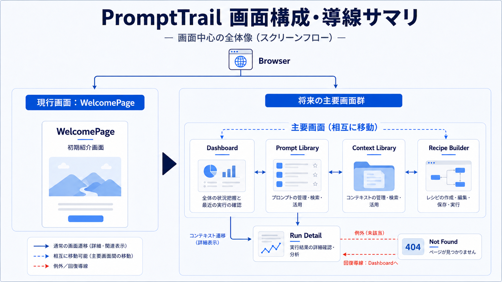
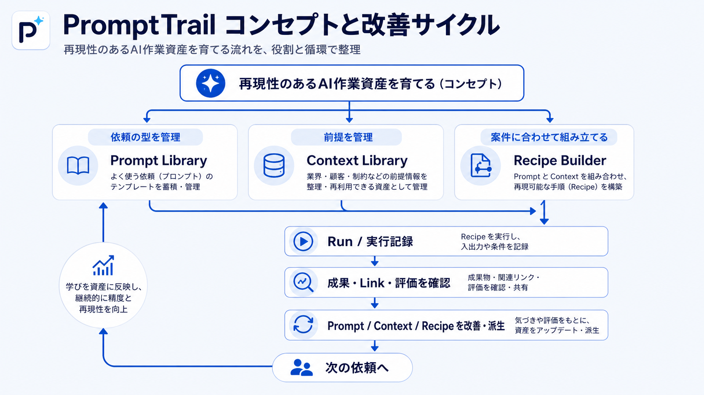
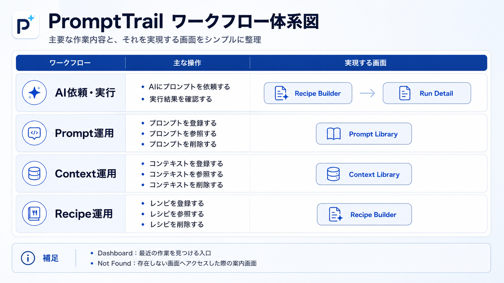
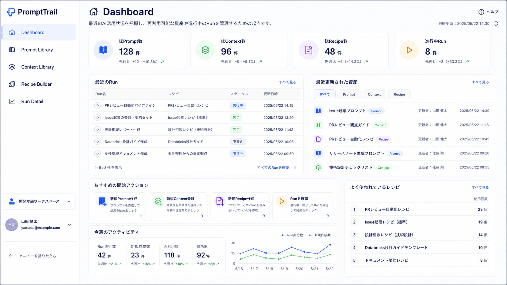
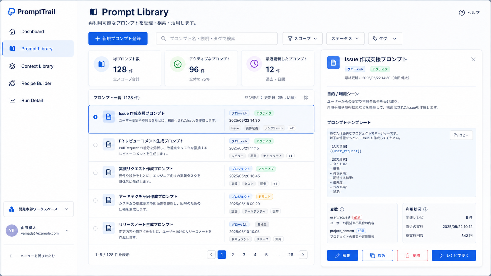
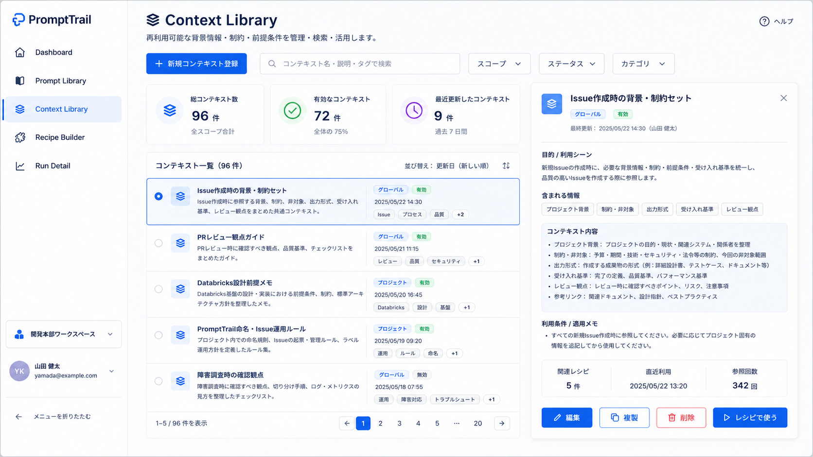
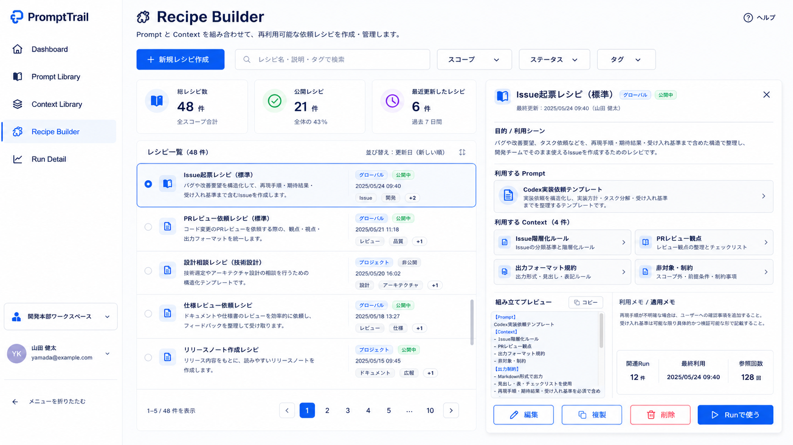
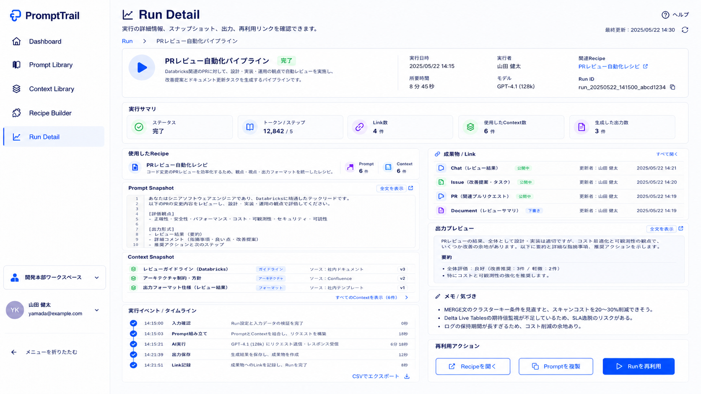

# PromptTrail Screen Structure and User Flow

この資料は、PromptTrail の **画面構成・利用導線ドキュメント** です。狭義の画面遷移図ではなく、利用者から見える画面、画面責務、Prompt / Context / Recipe / Run の利用導線、画面構成イメージを整理するための正本として扱います。

対象時点は **P0-4-3 完了時点** です。現在の実装は BrowserRouter、AppShell、AppRouter により、Dashboard、Prompt Library、Context Library、Recipe Builder、Run Detail、Not Found に到達でき、主要5画面は `PageHeader`、`StateMessage`、`PageSection` を中心にした静的画面骨格を持ちます。主要画面の本格 UI、実データ表示、Repository 連携、CRUD は P0-5 以降の対象です。

技術・責務境界、Runtime、Bootstrap、Provider、Repository、DB、Router、AppShell などの内部構造は [Application Architecture](application-architecture.md) を正本とし、本資料では主対象にしません。URL、route parameter、Router 契約、Not Found、直接 URL、戻る導線、到達・例外・復帰図の詳細は本資料の Route Contract を正本として扱います。

## 1. 画面構成・導線サマリ

### 第1節 全体サマリ

P0-4-3 完了時点の PromptTrail は、`/` から `/dashboard` へ redirect し、Dashboard を基本入口として利用者が AI 作業を再開する構成です。AppShell 配下では Dashboard、Prompt Library、Context Library、Recipe Builder、Run Detail、Not Found の各 Page に到達でき、主要 4 画面のグローバルナビゲーションと Dashboard への復帰導線を通じて移動できます。P0-4-3では静的画面骨格と利用開始状態までを実装済みであり、Repository 連携、実データ表示、CRUD、検索、保存、Run実行は先取りしていません。

- **Dashboard** は、`/dashboard` で表示される基本入口です。`/` からも redirect され、最近の Run、作業状況、再開ポイントを把握する場所として扱います。
- **Prompt Library** と **Context Library** は、固定の一本道ではなく並列に参照できる再利用資産の管理画面です。
- **Recipe Builder** は、Prompt と Context を案件に合わせて組み立て、Run へつなげる画面です。
- **Run Detail** は、実行記録、成果物、Link、評価、改善メモを確認・記録し、次の改善へ戻す画面です。
- **Not Found** は、未知 URL から Dashboard へ復帰するための recovery route です。
- Browser は必要に応じて外部の器・入口として扱いますが、App / Router / AppShell などの画面を持たない内部コンポーネントは主ノードとして扱いません。

### 第2節 コンセプト

PromptTrail のコンセプトは、AI への依頼を一回限りのテキストとして消費するのではなく、再現性のある AI 作業資産として育てることです。Prompt、Context、Recipe、Run、成果・Link・評価を循環させ、次の依頼へ学びを反映することで、継続的に精度と再現性を高めます。

- **依頼の型を管理する**: Prompt Library で、よく使う依頼テンプレートを蓄積・管理します。
- **前提を管理する**: Context Library で、業界・顧客・制約などの前提情報を整理し、再利用できる資産として管理します。
- **案件に合わせて組み立てる**: Recipe Builder で、Prompt と Context を組み合わせ、再現可能な手順である Recipe を構築します。
- **Run / 実行記録を残す**: Recipe を実行し、入出力や条件を記録します。
- **成果・Link・評価を確認する**: 成果物、関連リンク、評価を Run Detail 内で確認・記録します。
- **Prompt / Context / Recipe を改善・派生する**: 気づきや評価をもとに、再利用資産を更新・派生します。
- **次の依頼へつなげる**: 学びを資産に反映し、次回の依頼の精度と再現性を高めます。

## 2. ワークフロー体系図

PromptTrail のワークフローは、Prompt と Context を再利用資産として蓄積し、Recipe Builder で案件に合わせて組み立て、Run Detail で実行結果と成果へのつながりを記録する流れです。Prompt Library から Context Library へ進んで Recipe Builder に到達する固定の一本道ではなく、Prompt と Context を並列の資産として扱います。

- **Prompt Library** は、AI への依頼の型を管理します。
- **Context Library** は、AI へ渡す背景・制約・前提を管理します。
- **Recipe Builder** は、Prompt と Context を案件に合わせて組み立て、Recipe として保存し、実行準備へつなげます。
- **Run Detail** は、実行記録、成果物、Link、評価を確認し、次の Prompt / Context / Recipe 改善へ戻すための記録領域を持ちます。
- **Dashboard** は、最近の作業、Run、再開ポイント、未整理 Link を把握する入口です。

## 3. 画面別役割整理

| 画面            | 一言定義                                                | 解決する課題                           | 主な操作                                               | 関連資産                  |
| --------------- | ------------------------------------------------------- | -------------------------------------- | ------------------------------------------------------ | ------------------------- |
| Dashboard       | 作業状況を把握し、次の行動へ進む入口                    | どの AI 作業を再開すべきか分からない   | 最近の Run 確認、作業再開、未整理 Link 確認            | Run / Recipe / Link       |
| Prompt Library  | AI への依頼方法を再利用する場所                         | 良い依頼パターンを毎回作り直している   | 登録、検索、参照、改善、削除                           | Prompt                    |
| Context Library | AI へ渡す背景・制約・前提を再利用するための資産管理画面 | 毎回同じ背景説明や制約を繰り返している | 登録、検索、参照、整理、削除                           | Context                   |
| Recipe Builder  | Prompt と Context を組み合わせて依頼単位を作る場所      | 毎回ゼロから依頼を組み立てている       | Prompt 選択、Context 組み合わせ、Recipe 保存、実行準備 | Prompt / Context / Recipe |
| Run Detail      | 実行結果と成果を振り返り、次へ改善する場所              | 何を使って何が得られたか追跡できない   | Snapshot 確認、成果物確認、Link 確認、評価、改善メモ   | Run / Link / Snapshot     |

Context Library は、何でも保存するメモ帳ではなく、**AI へ渡す背景・制約・前提を再利用するための資産管理画面** として扱います。また、成果物・Link・評価は独立メニューではなく、Run Detail 内の確認・記録領域として扱います。

上記の「主な操作」はPromptTrailが目指す画面責務を示します。P0-4-3で実装済みなのは利用開始状態としての静的画面骨格までであり、登録、検索、参照、保存、実行、実データ表示は後続Issueで扱います。

## 4. 画面構成図

以下の画面構成図は、P0-4 以降の設計検討素材です。利用者が見る一覧、カード、詳細パネル、入力領域、操作導線を確認するためのものであり、P0-4-3 の実装仕様を細部まで固定するものではありません。App、Router、Repository、DB、Provider などの内部構造は描きません。

P0-4-3時点の実装は、これらの将来イメージを本格UIとして実装したものではなく、`PageHeader`、`StateMessage`、`PageSection`による静的骨格です。画像ファイルは設計素材として維持し、P0-4-3では再生成・最適化・リネームしません。

### Dashboard

### Prompt Library

### Context Library

### Recipe Builder

### Run Detail

## 5. P0-4-3 Page Skeleton Policy

P0-4-3 の主要画面は、個別画面を作り込む前に同じ骨格で段階的に実装しました。P0-4-3-1では画面ごとの本格 CRUD、検索、実データ取得、Repository 連携は行わず、後続Lv4が同じ粒度でplaceholderを置き換えられる型紙として `PageSection` と Page Skeleton Policy を固定しました。P0-4-3-2〜4で主要5画面の静的骨格と状態表示方針を整備済みです。

### 共通構成

- **PageHeader**: 画面名、画面目的、短い説明を置く最上位領域です。画面単位の主要 action は `actions` に置けますが、未実装機能の保存・実行・作成を動く導線として先取りしません。
- **PageSection**: 主要領域を表す `pt-card` ベースの軽量パターンです。セクション見出し、補足説明、任意 action、本文をまとめ、Dashboard、Library、Builder、Detail の静的骨格で共通利用します。
- **StateMessage**: 空状態、準備中、失敗状態の利用者向け説明に使います。P0-4-3 では Repository からの実データ取得を前提にせず、Page Start Stateとして何を始める画面か、P0-5以降で何に置き換えるかを説明する用途を優先します。
- **Button / `.pt-card`**: 操作風の見た目やカード表現は既存 primitive を再利用します。リンクは Router の既存 route に限定し、新しい route や未実装の保存・実行処理は追加しません。
- **Notice**: P0-5 以降で実データ表示に置き換える領域は、画面本文または `StateMessage` の説明として明示します。

### 状態表示方針

P0-4-3 の状態表示は、Repository 連携前の利用開始状態と、将来の Repository 連携後状態を混同しないように分けます。

| 分類                            | 表示主体                          | `StateMessage` variant | P0-4-3 での扱い                                                        |
| ------------------------------- | --------------------------------- | ---------------------- | ---------------------------------------------------------------------- |
| App Initialization              | `ApplicationBootstrap`            | `loading`              | Repository 初期化中を表示し、Page Start State はまだ表示しない         |
| App Initialization Failure      | `ApplicationBootstrap`            | `error`                | Repository 初期化失敗を表示し、Page は描画しない                       |
| Page Start State                | 各 Page                           | `empty`                | 実データ取得前の静的な利用開始状態として、画面目的と後続置換予定を示す |
| Future Repository Empty State   | 各 Page / Repository API 利用箇所 | `empty`                | P0-5 以降で、Repository 取得後にデータ 0 件だった状態として扱う        |
| Future Repository Failure State | 各 Page / Repository API 利用箇所 | `error`                | P0-5 以降で、Repository 利用失敗時の復旧案内として扱う                 |
| Route Recovery State            | Router / Route Page               | `error`                | 未知 URL と Run Detail 直接 URL から Dashboard へ戻る導線を維持する    |

`StateMessage` の `title` は状態を短く表し、`description` は「なぜその状態か」「次に何をするか」「将来何に置き換わるか」を説明します。将来実装予定の注記は、実データ、疑似データ、実件数に見えない文言に留めます。

### 主要画面の section 方針

| 画面            | P0-4-3で実装したsection方針                                             | 固定する境界                                                                                  |
| --------------- | ------------------------------------------------------------------------ | --------------------------------------------------------------------------------------------- |
| Dashboard       | 最近のRun、再開ポイント、未整理Link、次にやること                       | 集計やRepository取得は行わず、利用開始状態の静的案内に留める                                  |
| Prompt Library  | Prompt資産、分類・検索予定、作成導線予定、Recipeへの接続                | CRUD、検索、タグ、フィルタは実装しない                                                        |
| Context Library | Context資産、背景・制約・前提の整理、分類・検索予定、Recipeへの接続     | 何でも保存するメモではなくAIへ渡す前提資産として説明する                                      |
| Recipe Builder  | Prompt選択、Context選択、Recipe組み立て、実行準備                       | Recipe保存、Run実行、Repository連携は実装しない                                               |
| Run Detail      | 実行サマリ、使用したRecipe、Prompt Snapshot、Context Snapshot、成果物 / Link、評価、改善メモ | 成果物・Link・評価はRun Detail内sectionとして扱い、独立routeや独立メニューを追加しない |
| Not Found       | Dashboard復帰                                                           | 主要画面骨格の対象外とし、既存のDashboard復帰導線を維持する                                   |

### P0-4-4への引き渡し

P0-4-4では、P0-4-3で揃えた画面骨格と状態表示方針を壊さないため、次の品質・回帰観点を扱います。

- Root URLからDashboardへredirectすること。
- Dashboard、Prompt Library、Context Library、Recipe Builderのdirect URL表示とactive nav判定。
- Run DetailとNot Foundではactive navが付かず、`routePaths.dashboard`を参照したDashboard復帰導線を維持すること。
- ApplicationBootstrapのloading / error / ready状態。
- 主要PageのPage Start Stateが、Repository連携後のempty / failure stateや実データ表示に見えないこと。
- Repository連携、CRUD、検索、タグ、フィルタ、Recipe保存、Run実行、新route、Global Navigation変更を先取りしていないこと。

## 6. Route Contract

P0-4-2 以降の Router / AppShell 実装は、画面構成・利用導線の正本である本資料と、技術・責務境界の正本である [Application Architecture](application-architecture.md) を接続するため、次の Route Contract を参照します。内部構造や Provider / Repository / DB の責務境界は Application Architecture を正本とし、本節では利用者から見える URL、画面概念、ナビゲーション上の扱いのみを固定します。

| route id         | path               | 画面             | ナビ表示 | 分類 / 備考                                                                      |
| ---------------- | ------------------ | ---------------- | -------- | -------------------------------------------------------------------------------- |
| `root`           | `/`                | redirect / alias | なし     | `/dashboard` へ redirect する入口                                                |
| `dashboard`      | `/dashboard`       | Dashboard        | あり     | P0-4 以降の基本入口                                                              |
| `promptLibrary`  | `/prompts`         | Prompt Library   | あり     | Prompt 資産管理                                                                  |
| `contextLibrary` | `/contexts`        | Context Library  | あり     | Context 資産管理                                                                 |
| `recipeBuilder`  | `/recipes/builder` | Recipe Builder   | あり     | Recipe 作成・編集入口                                                            |
| `runDetail`      | `/runs/:runId`     | Run Detail       | なし     | contextual route。常設グローバルナビではなく、Run などの文脈から到達する詳細画面 |
| `notFound`       | `*`                | Not Found        | なし     | recovery route。未知 URL から復帰導線を提示するための画面                        |

グローバルナビゲーション対象は Dashboard、Prompt Library、Context Library、Recipe Builder の 4 つに限定します。Run Detail は実行文脈にひもづく contextual route、Not Found は未知 URL からの recovery route として扱い、どちらも常設グローバルナビゲーションには含めません。

アクティブナビ判定は、現在 URL が `/dashboard`、`/prompts`、`/contexts`、`/recipes/builder` のいずれかに一致するときだけ対応するグローバルナビを active とします。`/` は `/dashboard` へ redirect されます。`/runs/:runId` と未知 URL は active nav なしとして扱います。Run Detail と Not Found の復帰導線は `routePaths.dashboard` を参照した「Dashboardへ戻る」リンクで固定し、ブラウザ履歴や `navigate(-1)` には依存しません。

### 更新トリガー

この資料は、次の変更が入ったときに更新を検討します。

- Dashboard、Prompt Library、Context Library、Recipe Builder、Run Detail の主要画面責務が変わるとき。
- Prompt / Context / Recipe / Run のワークフロー体系が変わるとき。
- 画面構成イメージ、画面名、画面順序、画面内の主要領域が変わるとき。
- Router / URL 契約が確定し、本資料の導線説明と差分が生じるとき。
- Projects、Trail View、Settings を本資料の対象画面へ追加する判断が行われるとき。
- P0-5以降でRepository連携、実データ表示、CRUD、empty / failure stateの本格実装が入るとき。
