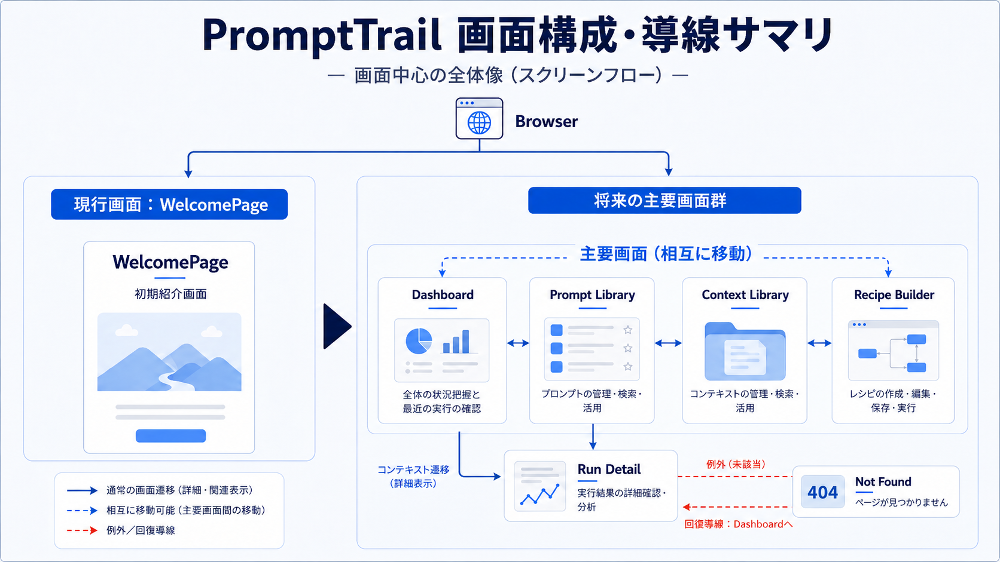
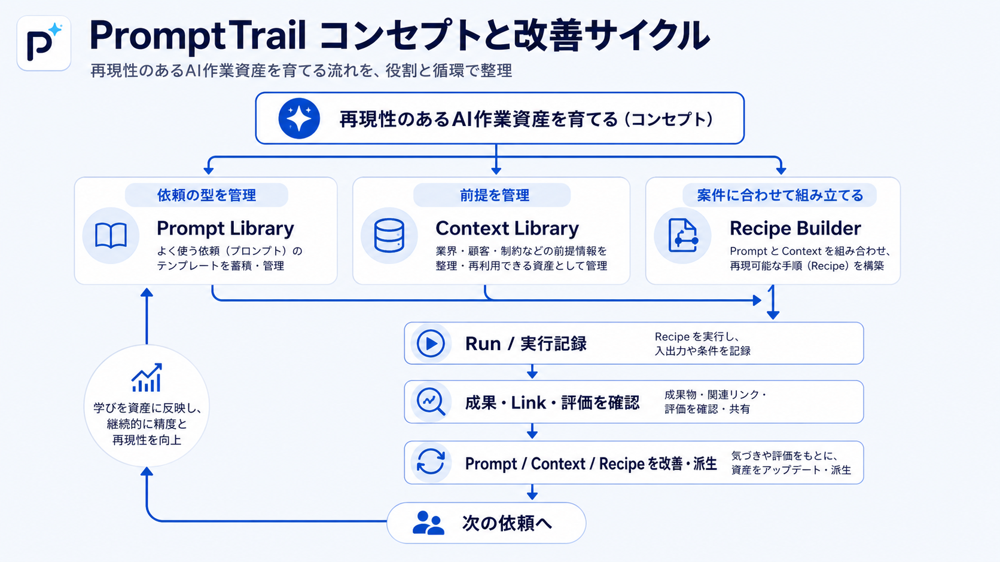
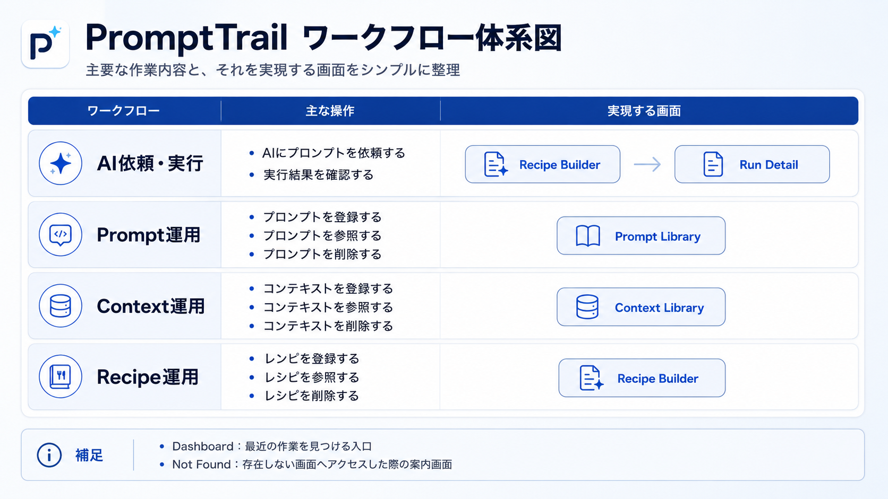
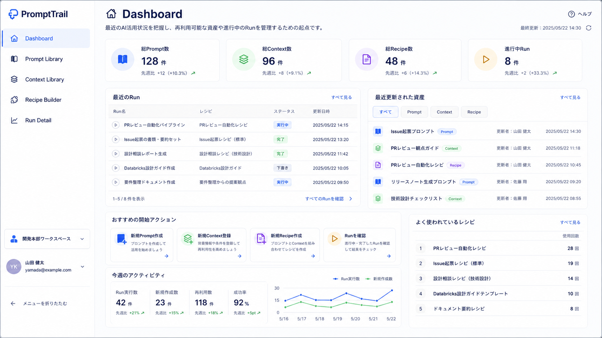
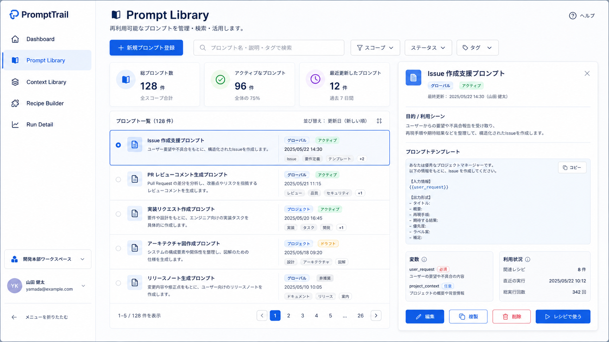
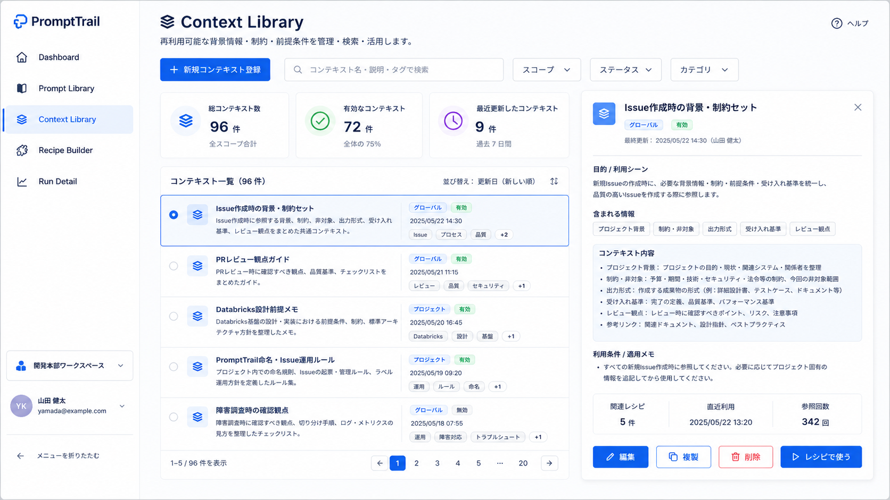
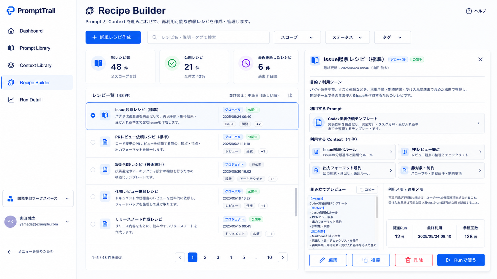
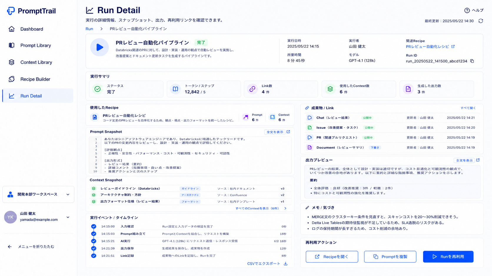

# PromptTrail Screen Structure and User Flow

この資料は、PromptTrail の **画面構成・利用導線ドキュメント** です。狭義の画面遷移図ではなく、利用者から見える画面、画面責務、Prompt / Context / Recipe / Run の利用導線、画面構成イメージを整理するための正本として扱います。

対象時点は **Phase 2 Prompt新規登録・編集・論理削除機能実装時点**です。`/`のPublic Alpha Guide、Repository接続済みのDashboard、Run Detail、Prompt Library、Prompt Editor、PromptからDirect Runを作成するNew Trail、未完成画面のContext Library／Recipe Builder、Not Foundへ到達できます。PromptからのTrail作成、Trailの識別・到達性を補完する後続計画は[Roadmap](roadmap.md)を正本とします。

技術・責務境界、Runtime、Bootstrap、Provider、Repository、DB、Router、AppShell などの内部構造は [Application Architecture](application-architecture.md) を正本とし、本資料では主対象にしません。Phase 0 の横断的な実装状態は [PromptTrail Phase 0 Technical Baseline](../../architecture/prompt-trail/README.md) を参照してください。URL、route parameter、Router 契約、Not Found、直接 URL、戻る導線、到達・例外・復帰図の詳細は本資料の Route Contract を正本として扱います。

## 1. 画面構成・導線サマリ

### 第1節 全体サマリ

Phase 1完了時点のPromptTrailは、`/`をPublic Alpha Guide、「はじめに」と「Dashboard」をGlobal Navigationに持ちます。Prompt Libraryは静的start state、Context Library／Recipe Builderは機能未実装の画面であり、いずれもdirect routeだけを維持して主要Navigationには表示しません。DashboardとRun DetailはRepositoryの実データを表示し、New TrailはDashboardから到達するcontextual routeです。

> 以下のPhase 0図版は将来の画面構成を検討するための構想図であり、Phase 1完了時点の実装画面や利用可能な機能を表すものではありません。

- **Public Alpha Guide** は、`/` で価値、主要操作、保存制約を案内し、Dashboard と Feedback へ接続します。
- **Dashboard** は、`/dashboard` で最近の Run、作業状況、再開ポイントを把握する場所です。
- **Prompt Library** は静的start stateを表示します。実データの一覧・編集・反復利用はPhase 2で実装する計画です。
- **Context Library** と **Recipe Builder** は未完成画面です。主要機能はPhase 1完了時点では利用できません。
- **New Trail** は、Trail名・Trail種別・Prompt本文から新しい作業を作成します。過去Runからの再利用時は3項目を編集可能な初期値として引き継ぎます。
- **Run Detail** は、実行時点のPrompt Snapshotと関連Linkの確認、および関連Linkの登録を中心に提供します。評価・改善メモは現行機能ではなく将来候補です。
- **Not Found** は、未知 URL から Dashboard へ復帰するための recovery route です。
- Browser は必要に応じて外部の器・入口として扱いますが、App / Router / AppShell などの画面を持たない内部コンポーネントは主ノードとして扱いません。

### 第2節 コンセプト

> この節とPhase 0図版は将来構想を説明します。Phase 1完了時点の実装済み機能一覧ではありません。

PromptTrail のコンセプトは、AI への依頼を一回限りのテキストとして消費するのではなく、再現性のある AI 作業資産として育てることです。Prompt、Context、Recipe、Run、成果・Link・評価を循環させ、次の依頼へ学びを反映することで、継続的に精度と再現性を高めます。

- **依頼の型を管理する**: Prompt Library で、よく使う依頼テンプレートを蓄積・管理します。
- **前提を管理する**: Context Library で、業界・顧客・制約などの前提情報を整理し、再利用できる資産として管理します。
- **案件に合わせて組み立てる**: Recipe Builder で、Prompt と Context を組み合わせ、再現可能な手順である Recipe を構築します。
- **Run / 実行記録を残す**: Recipe を実行し、入出力や条件を記録します。
- **成果・Link・評価を確認する**: 成果物、関連リンク、評価を Run Detail 内で確認・記録します。
- **Prompt / Context / Recipe を改善・派生する**: 気づきや評価をもとに、再利用資産を更新・派生します。
- **次の依頼へつなげる**: 学びを資産に反映し、次回の依頼の精度と再現性を高めます。

## 2. ワークフロー体系図

> 本節は将来のワークフロー構想です。Context Library、Recipe Builder、評価、改善メモはPhase 1完了時点では未実装です。

PromptTrail のワークフローは、Prompt と Context を再利用資産として蓄積し、Recipe Builder で案件に合わせて組み立て、Run Detail で実行結果と成果へのつながりを記録する流れです。Prompt Library から Context Library へ進んで Recipe Builder に到達する固定の一本道ではなく、Prompt と Context を並列の資産として扱います。

- **Prompt Library** は、AI への依頼の型を管理します。
- **Context Library** は、AI へ渡す背景・制約・前提を管理します。
- **Recipe Builder** は、Prompt と Context を案件に合わせて組み立て、Recipe として保存し、実行準備へつなげます。
- **Run Detail** は、実行記録、成果物、Link、評価を確認し、次の Prompt / Context / Recipe 改善へ戻すための記録領域を持ちます。
- **Dashboard** は、最近の作業、Run、再開ポイント、未整理 Link を把握する入口です。

## 3. 画面別役割整理

以下は将来の画面責務を整理した構想です。Phase 1完了時点ではPrompt Libraryは静的start state、Context Library／Recipe Builderは未完成画面です。Run Detailで現行利用できる中心機能はPrompt Snapshotと関連Linkの確認・登録であり、評価・改善メモは将来候補です。

| 画面            | 一言定義                                                | 解決する課題                           | 主な操作                                               | 関連資産                  |
| --------------- | ------------------------------------------------------- | -------------------------------------- | ------------------------------------------------------ | ------------------------- |
| Dashboard       | 作業状況を把握し、次の行動へ進む入口                    | どの AI 作業を再開すべきか分からない   | 最近の Run 確認、作業再開、未整理 Link 確認            | Run / Recipe / Link       |
| Prompt Library  | AI への依頼方法を再利用する場所                         | 良い依頼パターンを毎回作り直している   | 登録、検索、参照、改善、削除                           | Prompt                    |
| Context Library | AI へ渡す背景・制約・前提を再利用するための資産管理画面 | 毎回同じ背景説明や制約を繰り返している | 登録、検索、参照、整理、削除                           | Context                   |
| Recipe Builder  | Prompt と Context を組み合わせて依頼単位を作る場所      | 毎回ゼロから依頼を組み立てている       | Prompt 選択、Context 組み合わせ、Recipe 保存、実行準備 | Prompt / Context / Recipe |
| Run Detail      | 実行結果と成果を振り返り、次へ改善する場所              | 何を使って何が得られたか追跡できない   | Snapshot 確認、成果物確認、Link 確認、評価、改善メモ   | Run / Link / Snapshot     |

Context Library は、何でも保存するメモ帳ではなく、**AI へ渡す背景・制約・前提を再利用するための資産管理画面** として扱います。また、成果物・Link・評価は独立メニューではなく、Run Detail 内の確認・記録領域として扱います。

## 4. 画面構成図

以下のPhase 0画面構成図は将来構想の設計検討素材であり、Phase 1完了時点の実装画面ではありません。利用者が見る一覧、カード、詳細パネル、入力領域、操作導線を検討するためのものであり、P0-4-3 の実装仕様を細部まで固定するものでもありません。App、Router、Repository、DB、Provider などの内部構造は描きません。

### Dashboard

### Prompt Library

### Context Library

### Recipe Builder

### Run Detail

## 5. P0-4-3 Page Skeleton Policy（設計経緯）

この節は P0-4-3 で確立した静的 Page Skeleton の設計経緯です。当時は Dashboard、Prompt Library、Context Library、Recipe Builder、Run Detail が静的骨格でした。P0-5 で Dashboard が Repository 実データ表示へ移行し、P1-1-1-2 で Run Detail も Repository 接続済みへ移行しました。Phase 1完了時点ではPrompt Libraryが静的start stateであり、Context Library／Recipe Builderは主要機能が未実装の画面です。画面ごとの本格 CRUD、検索、Recipe 実行、Dashboard 以外の Repository 連携は Phase 0 の対象外です。

### 共通構成

- **PageHeader**: 画面名、画面目的、短い説明を置く最上位領域です。画面単位の主要 action は `actions` に置けますが、未実装機能の保存・実行・作成を動く導線として先取りしません。
- **PageSection**: 主要領域を表す `pt-card` ベースの軽量パターンです。セクション見出し、補足説明、任意 action、本文をまとめ、Dashboard、Library、Builder、Detail の静的骨格で共通利用します。
- **StateMessage**: 空状態、準備中、失敗状態の利用者向け説明に使います。P0-4-3 では Repository からの実データ取得を前提にせず、何を始める画面か、次にどの後続 Issue で置き換えるかを説明する用途を優先します。
- **Button / `.pt-card`**: 操作風の見た目やカード表現は既存 primitive を再利用します。リンクは Router の既存 route に限定し、新しい route や未実装の保存・実行処理は追加しません。
- **Notice**: P0-5 以降で実データ表示に置き換える領域は、画面本文または `StateMessage` の説明として明示します。

### 状態表示方針

P0-4-3 の状態表示は、Repository 連携前の利用開始状態と、将来の Repository 連携後状態を混同しないように分けます。

| 分類                            | 表示主体                          | `StateMessage` variant | P0-4-3 での扱い                                                        |
| ------------------------------- | --------------------------------- | ---------------------- | ---------------------------------------------------------------------- |
| App Initialization              | `ApplicationBootstrap`            | `loading`              | Repository 初期化中を表示し、Page Start State はまだ表示しない         |
| App Initialization Failure      | `ApplicationBootstrap`            | `error`                | Repository 初期化失敗を表示し、Page は描画しない                       |
| Page Start State                | 各 Page                           | `empty`                | 実データ取得前の静的な利用開始状態として、画面目的と後続置換予定を示す |
| Future Repository Empty State   | 各 Page / Repository API 利用箇所 | `empty`                | P0-5 以降で、Repository 取得後にデータ 0 件だった状態として扱う        |
| Future Repository Failure State | 各 Page / Repository API 利用箇所 | `error`                | P0-5 以降で、Repository 利用失敗時の復旧案内として扱う                 |
| Route Recovery State            | Router / Route Page               | `error`                | 未知 URL と Run Detail 直接 URL から Dashboard へ戻る導線を維持する    |

`StateMessage` の `title` は状態を短く表し、`description` は「なぜその状態か」「次に何をするか」「将来何に置き換わるか」を説明します。将来実装予定の注記は、実データ、疑似データ、実件数に見えない文言に留めます。

### 主要画面の section 方針

| 画面            | 後続 Lv4 で置き換える section 方針                                           | P0-4-3-1 で固定する境界                                                                      |
| --------------- | ---------------------------------------------------------------------------- | -------------------------------------------------------------------------------------------- |
| Dashboard       | 作業再開、最近の Run、未整理 Link、次にやること                              | 集計や Repository 取得は行わず、利用開始状態の静的案内に留める                               |
| Prompt Library  | 依頼テンプレート資産、分類・検索予定、作成導線予定                           | CRUD、検索、タグ、フィルタは実装しない                                                       |
| Context Library | 背景・制約・前提資産、分類・検索予定、作成導線予定                           | 何でも保存するメモではなく AI へ渡す前提資産として説明する                                   |
| Recipe Builder  | Prompt 選択、Context 選択、Recipe 組み立て、実行準備                         | Recipe 保存、Run 実行、Repository 連携は実装しない                                           |
| Run Detail      | 実行サマリ、Prompt Snapshot、Context Snapshot、成果物 / Link、評価、改善メモ | 成果物・Link・評価は Run Detail 内 section として扱い、独立 route や独立メニューを追加しない |
| Not Found       | Dashboard 復帰                                                               | 主要画面骨格の対象外とし、既存の Dashboard 復帰導線を維持する                                |

### P0-4-3 完了時点の棚卸しと後続への引き渡し

- Prompt Library は `PageHeader`、`PageSection`、`StateMessage` の組み合わせによる静的start stateです。Context Library／Recipe Builderは同じ画面骨格だけを持つ未完成画面です。Run DetailはP1-1-1-2でRepository接続済みとなり、現行ではPrompt Snapshotと関連Linkの確認・登録を担います。
- Not Found は主要画面骨格の対象外ですが、`PageHeader` と `StateMessage variant="error"` により未知 URL と Dashboard 復帰導線を示します。
- Run Detailの評価・改善メモ等は将来候補であり、Phase 1完了時点の機能として扱いません。Run DetailとNot FoundのDashboard復帰リンクは維持します。
- ApplicationBootstrap の loading / error と、各 Page の Page Start State、将来の Repository empty / failure state は混同しません。
- P0-4-4 へは、主要画面導線、direct URL / root redirect / unknown URL、Run Detail / Not Found の Dashboard 復帰、Global Navigation の active 判定、Page Skeleton と `StateMessage` の表示崩れ、P0-5 以降で Repository empty / failure state に差し替える観点を引き渡します。

## 6. Route Contract

現行の Router / AppShell 実装は、画面構成・利用導線の正本である本資料と、技術・責務境界の正本である [Application Architecture](application-architecture.md) を接続するため、次の Route Contract を参照します。内部構造や Provider / Repository / DB の責務境界は Application Architecture を正本とし、本節では利用者から見える URL、画面概念、ナビゲーション上の扱いのみを固定します。

| route id         | path                      | 画面               | ナビ表示 | 分類 / 備考                                                                      |
| ---------------- | ------------------------- | ------------------ | -------- | -------------------------------------------------------------------------------- |
| `root`           | `/`                       | Public Alpha Guide | あり     | 価値、主要操作、保存制約、Dashboard / Feedbackへの入口                           |
| `dashboard`      | `/dashboard`              | Dashboard          | あり     | P0-4 以降の基本入口                                                              |
| `promptLibrary`  | `/prompts`                | Prompt Library     | なし     | Active Promptの一覧・検索と新規登録・編集への導線。主要Navigationには未表示      |
| `promptNew`      | `/prompts/new`            | Prompt Editor      | なし     | Default Project配下のActive Promptを新規登録するcontextual route                 |
| `promptEdit`     | `/prompts/:promptId/edit` | Prompt Editor      | なし     | Active Promptを編集し、Danger Zoneから確認付きで論理削除するcontextual route     |
| `contextLibrary` | `/contexts`               | Context Library    | なし     | 未完成の間はdirect accessのみ                                                    |
| `recipeBuilder`  | `/recipes/builder`        | Recipe Builder     | なし     | 未完成の間はdirect accessのみ                                                    |
| `newTrail`       | `/runs/new`               | New Trail          | なし     | Dashboard CTA から到達する contextual route。global navigation には含めない      |
| `runDetail`      | `/runs/:runId`            | Run Detail         | なし     | contextual route。常設グローバルナビではなく、Run などの文脈から到達する詳細画面 |
| `notFound`       | `*`                       | Not Found          | なし     | recovery route。未知 URL から復帰導線を提示するための画面                        |

Prompt EditorのDanger Zoneは編集Routeだけに表示し、保存済みタイトルと「今後の利用対象から除外する一方、過去Run・関連Link・実行時のPrompt Snapshotは残る」ことを確認してから`deletedAt`を設定します。削除はPromptだけに限定した非Cascade操作で、成功後はPrompt Libraryへ遷移して一回限りの通知を表示します。削除済みPromptの編集Routeはunavailableを表示します。

現行のグローバルナビゲーション対象は「はじめに」とDashboardです。Prompt LibraryはP2-1-4の仕様・UI洗練後に主要Navigationへ戻し、Context Library / Recipe Builderは利用可能になるまで表示しません。Run Detailは実行文脈にひもづくcontextual route、Not Foundは未知URLからのrecovery routeとして扱います。

アクティブナビ判定は、現行では`/`または`/dashboard`に一致するときだけ対応項目をactiveとします。`/runs/:runId`、direct accessの未完成Library、未知URLはactive navなしとして扱います。Run DetailとNot Foundの復帰導線は`routePaths.dashboard`を参照した「Dashboardへ戻る」リンクで固定し、ブラウザ履歴や`navigate(-1)`には依存しません。

### 更新トリガー

この資料は、次の変更が入ったときに更新を検討します。

- Dashboard、Prompt Library、Context Library、Recipe Builder、Run Detail の主要画面責務が変わるとき。
- Prompt / Context / Recipe / Run のワークフロー体系が変わるとき。
- 画面構成イメージ、画面名、画面順序、画面内の主要領域が変わるとき。
- Router / URL 契約が確定し、本資料の導線説明と差分が生じるとき。
- Projects、Trail View、Settings を本資料の対象画面へ追加する判断が行われるとき。

### Run Detail の Trail 情報

Trail 情報は `view`、`editing`、`submitting`、`failure`、`stale` の状態を持つ。保存成功は同じ Route 上で Page Header、Trail 情報、Updated At に即時反映され、reload と直接 Route でも永続化結果を確認できる。別タブとの競合では draft を保持して「最新内容を読み込む」を表示し、明示操作後に最新 Run の view 状態へ戻る。
